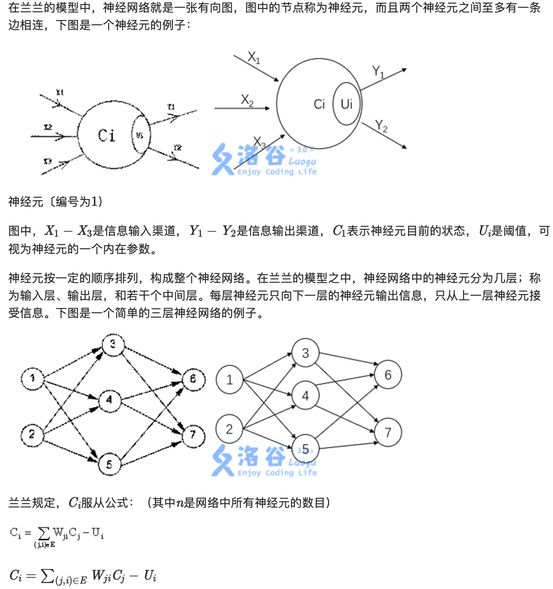
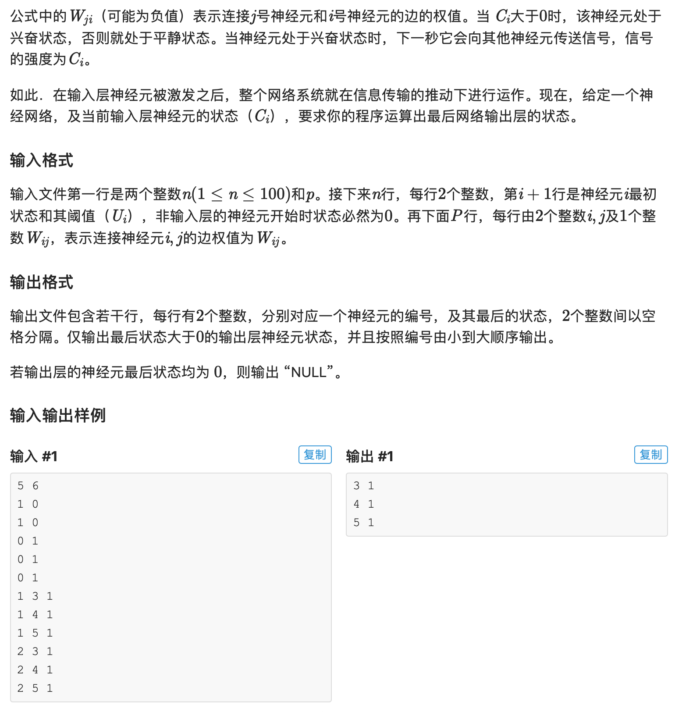

## P1038 神经网络

题目描述：

人工神经网络（ArtificialNeuralNetworkArtificialNeuralNetwork）是一种新兴的具有自我学习能力的计算系统，在模式识别、函数逼近及贷款风险评估等诸多领域有广泛的应用。对神经网络的研究一直是当今的热门方向，兰兰同学在自学了一本神经网络的入门书籍后，提出了一个简化模型，他希望你能帮助他用程序检验这个神经网络模型的实用性。






### 思路

* 


### Solution

```c++
#include<iostream>
#include<cstdio>

#define _ 0

using namespace std;

struct edge
{
    int v,w,ne;
}a[5000];

int n,p,tmp;
int c[110],u[110],h[110],in[110],out[110];
bool v[110];

int main()
{
    scanf("%d%d",&n,&p);
    for(int i=1;i<=n;i++)
    {
        scanf("%d%d",&c[i],&u[i]);
        if(c[i]>0)u[i]=-1;
    }
    for(int s,d,w,i=1;i<=p;i++)
    {
        scanf("%d%d%d",&s,&d,&w);
        a[++tmp]=(edge){d,w,h[s]};
        h[s]=tmp;
        in[d]++;
        out[s]++;
    }
    for(int tmp=1;tmp<=n;tmp++)
    {
        for(int i=1;i<=n;i++)
        {
            if(in[i]==0&&v[i]==0)
            {
                v[i]=1;
                if(u[i]!=-1)c[i]-=u[i];
                for(int j=h[i];j>0;j=a[j].ne)
                {
                    if(c[i]>0)
                    {
                        c[a[j].v]+=c[i]*a[j].w;
                    }
                    in[a[j].v]--;
                }
                break;
            }
        }
    }
    bool flag=0;
    for(int tmp=1;tmp<=n;tmp++)
    {
        if(out[tmp]==0&&c[tmp]>0)flag=1;
    }
    if(flag)
    {
        for(int tmp=1;tmp<=n;tmp++)
        {
            if(out[tmp]==0&&c[tmp]>0)
            {
                printf("%d %d\n",tmp,c[tmp]);

            }
        }
    }
    else
    {
        printf("NULL");
    }
    return ~~(0^_^0);
}
```


