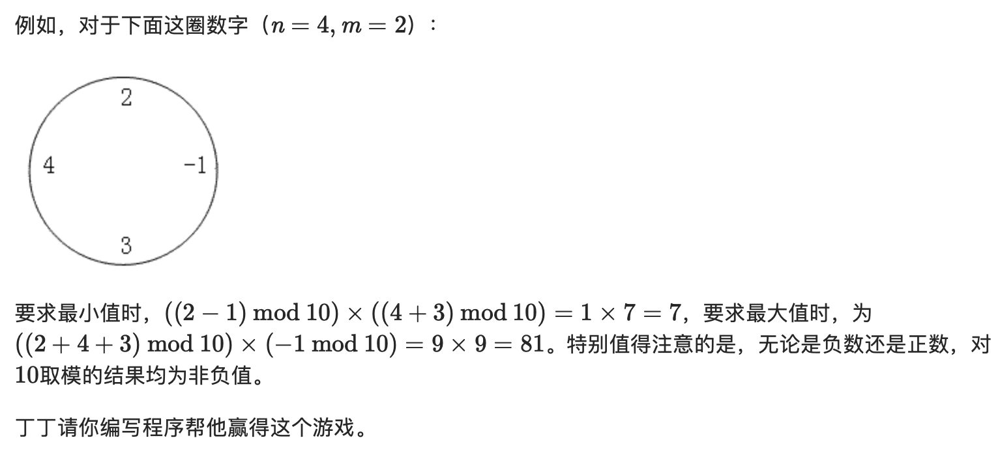

## P1043 数字游戏

题目描述：

丁丁最近沉迷于一个数字游戏之中。这个游戏看似简单，但丁丁在研究了许多天之后却发觉原来在简单的规则下想要赢得这个游戏并不那么容易。游戏是这样的，在你面前有一圈整数（一共n个），你要按顺序将其分为m个部分，各部分内的数字相加，相加所得的m个结果对10取模后再相乘，最终得到一个数k。游戏的要求是使你所得的k最大或者最小。



输入格式：

输入文件第一行有两个整数，n(1≤n≤50)和m(1≤m≤9)。以下n行每行有个整数，其绝对值≤104，按顺序给出圈中的数字，首尾相接。

输出格式：

输出文件有2行，各包含1个非负整数。第1行是你程序得到的最小值，第2行是最大值

输入输出样例：

```
4 2
4
3
-1
2

7
81
```

### 思路

* 动态规划
* 破环成链。没有太多的技巧性，具体而言就是把数据存储两遍，使得环形的数据可以链式展开，便于我们去DP。但最后一定要记得扫一遍答案，取F\[i][i+N-1]，i：1->N中的最大/小值。
* 前缀和。这个东西并不是在所有情况下都适用，但使用起来真的很方便，可以把O(n)的复杂度优化为O(1)。不过只适用于需要把数据直接相加的地方，比如说这道题。
* 初始化。这里实际上包括两点，一方面是在某些特殊情况下需要初始化，初始化为某特定值（比如本题只分成1段的时候）。另一方面也就是数组初始化，求最大值的时候根本不用管（因为初始默认为0），在求最小值的时候把数组全部赋初值为极大值就好啦。
* 状态表达。一般来说可以用F[i][j]表示在区间[i,j]中怎么怎么样，但由于本题还加了一个分为几段的状态，就把数组直接加一维就好了。

### Solution

```c++
#include<cstdio>
#include<algorithm>
#include<cstring>
#define oo 2147483647//是个好习惯，使程序显得有条理一点 
using namespace std;
int B[101][101][11],S[101][101][11];//区间[l,r]内分成i段的最大/小值 
int n,m; 
int a[101];//a存放前缀和 
int mod(int a)//写成函数方便一点 
{
    return ((a%10)+10)%10;
}
int main()
{
    scanf("%d %d",&n,&m);
    for (int i=1;i<=n;i++)
    {
        scanf("%d",&a[i]);
        a[i+n]=a[i];
    }
    for (int i=1;i<=2*n;i++)
      a[i]+=a[i-1];//前缀和 
    for (int l=1;l<=2*n;l++)
      for (int r=l;r<=2*n;r++)
        B[l][r][1]=S[l][r][1]=mod(a[r]-a[l-1]);//初始化不分段的状态 
    for (int i=2;i<=m;i++)
      for (int l=1;l<=2*n;l++)
        for (int r=l+i-1;r<=2*n;r++)
          S[l][r][i]=oo;//求最小值时记得把数组初始化为极大值 
    for (int i=2;i<=m;i++)//枚举分段数 
      for (int l=1;l<=2*n;l++)//枚举左端点 
        for (int r=l+i-1;r<=2*n;r++)//枚举右端点 
        {
            for (int k=l+i-2;k<r;k++)//枚举区间断点 注意范围 
            {
                S[l][r][i]=min (S[l][r][i],S[l][k][i-1]*mod(a[r]-a[k]));
                B[l][r][i]=max (B[l][r][i],B[l][k][i-1]*mod(a[r]-a[k]));
          }
        }
    int Max=0,Min=oo;//答案初始化 
    for (int i=1;i<=n;i++)
    {
        Max=max(Max,B[i][i+n-1][m]);//从前往后扫一遍 
        Min=min(Min,S[i][i+n-1][m]);
    }
    printf("%d\n%d",Min,Max);
    return 0;
}
```


