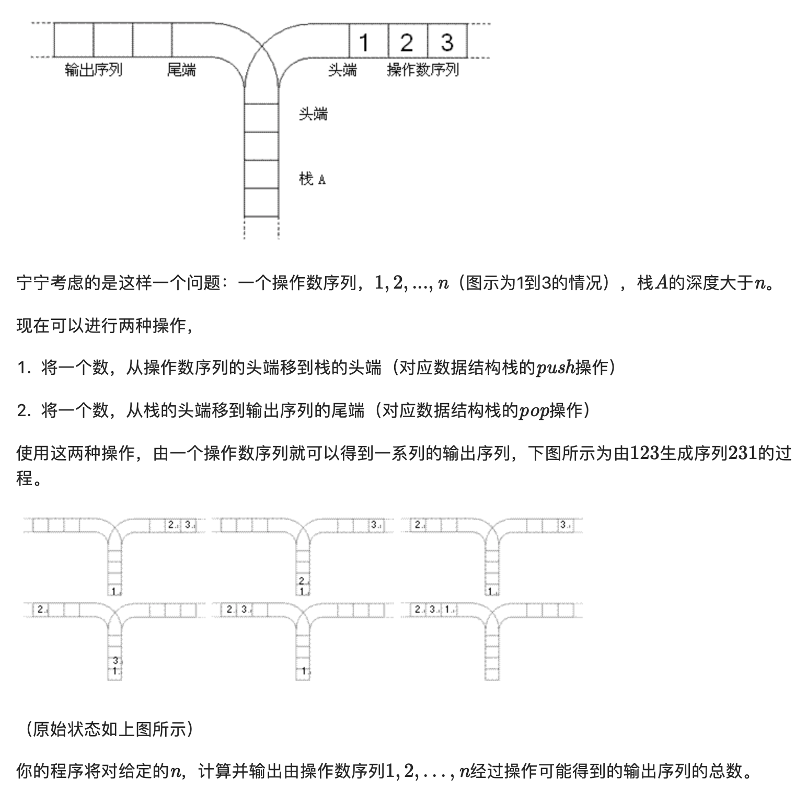

## P1044 栈(Catalan数)

题目描述：



输入格式：

输入文件只含一个整数n(1≤n≤18)

输出格式：

输出文件只有

1行，即可能输出序列的总数目

输入输出样例：

```
3 5
```

### 思路

* 卡特兰数

* h(0)=h(1)=1 

  h(n)= h(0)*h(n-1)+h(1)*h(n-2) + ... + h(n-1)*h(0) (n>=2)

### Solution

```c++
#include<cstdio>
#define siz 20
using namespace std;
int n;
int c[siz*2][siz];
int main(){

    scanf("%d",&n);
    for(int i=1;i<=2*n;i++) c[i][1]=c[i][i]=1;
    for(int i=3;i<=2*n;i++)
     for(int j=2;j<i;j++)
      c[i][j]=c[i-1][j]+c[i-1][j-1];
    printf("%d",c[2*n][n]-c[2*n][n-1]);
    return 0;
}
```


